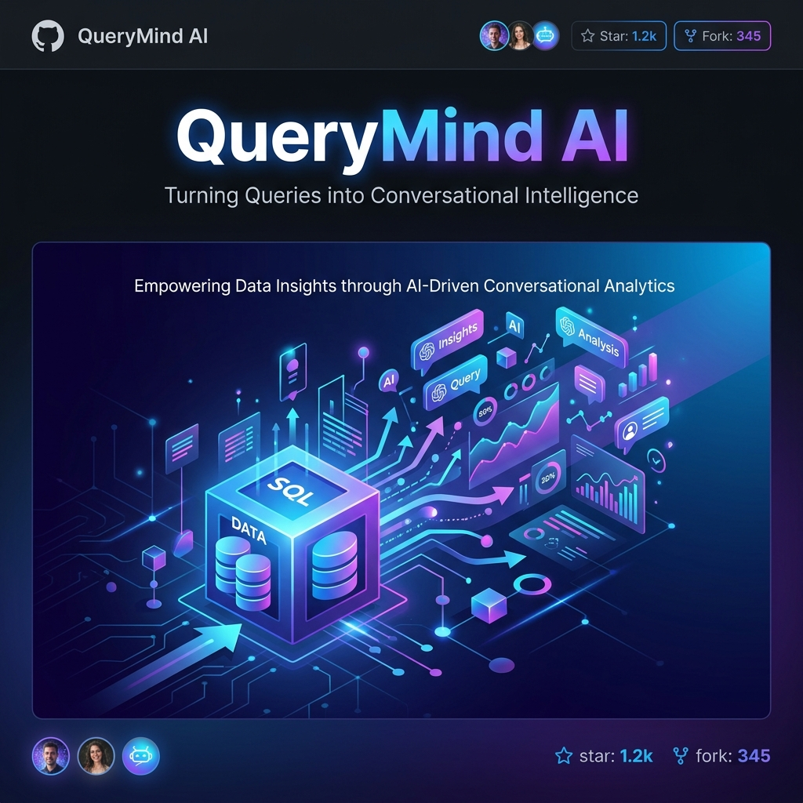
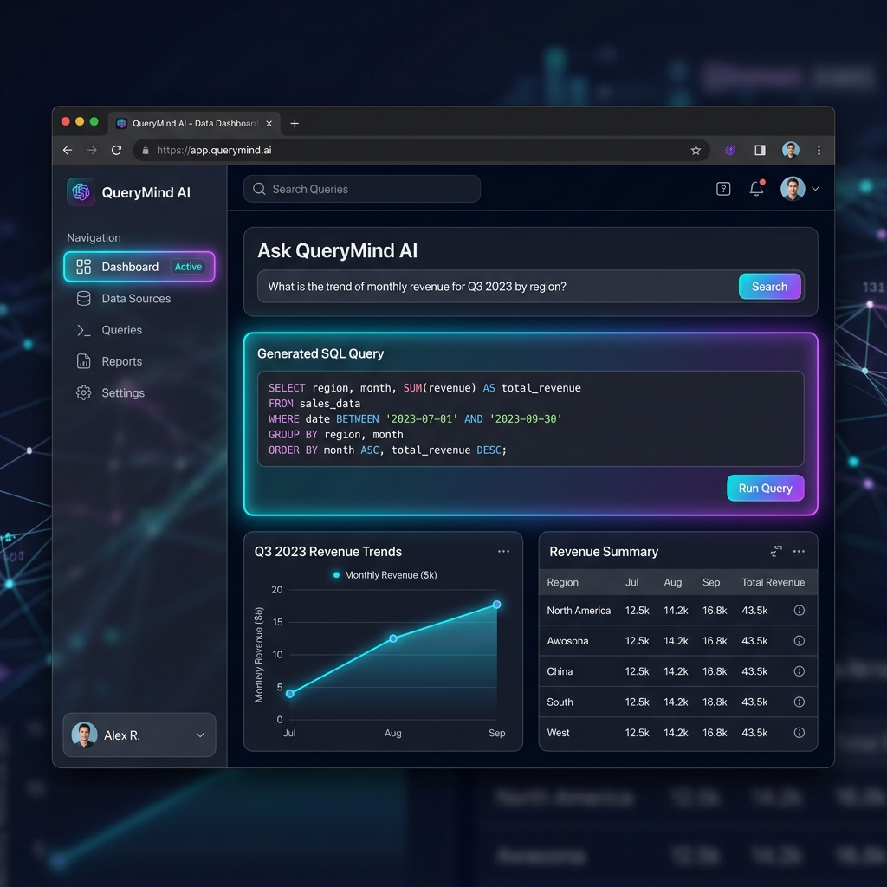

<div align="center">
  
</div>

# QueryMind AI 🧠📊


**QueryMind AI** is an advanced, enterprise-ready platform that converts your natural language questions into safe, optimized PostgreSQL queries. Built with a beautiful glassmorphism dark-mode UI, it allows anyone to instantly query, visualize, and analyze their database without writing a single line of SQL.

---

<div align="center">
  
</div>

---

## 🌟 Key Features

- **💬 Natural Language to SQL**: Convert plain English questions into safe, exact SQL queries using OpenAI.
- **📊 Dynamic Data Visualization**: Automatically generates beautiful Bar, Line, or Pie charts based on the context of your data.
- **🔌 Dynamic Database Connections**: Connect to your own custom PostgreSQL databases on the fly directly from the UI.
- **🔐 User Accounts & Workspaces**: Secure JWT-based authentication allows for multi-user support with isolated, private query histories.
- **🧠 Execution Plan & Performance Insights**: Deep dive into Postgres performance with built-in `EXPLAIN ANALYZE` metrics right in the dashboard.
- **🔄 Chat History Context**: Ask conversational follow-up questions (e.g. *"Show me users in NY"*, then *"Now sort them by age"*).
- **📥 CSV/Excel Export**: One-click downloads of your data sets for external reporting.
- **🛡️ Secure by Design**: Employs strict LLM prompting, `JSqlParser` AST validation, and read-only query locking to guarantee no destructive operations (`DROP`, `DELETE`, etc.) can be executed.

## 🚀 Quick Start

### Prerequisites
- Docker and Docker Compose
- Node.js (v18+)
- Java (v17+)
- An OpenAI API Key

### 1. Clone & Environment Setup

Clone the repository and copy the example environment files:

```bash
git clone https://github.com/Priyansh-6216/QueryMind_AI.git
cd QueryMind_AI

# Setup backend env
cp backend/.env.example backend/.env
# Setup frontend env
cp frontend/.env.example frontend/.env
```

Open `backend/.env` and securely add your OpenAI key:
```env
OPENAI_API_KEY=sk-your_api_key_here
```

### 2. Launch with Docker

The easiest way to start the entire stack (PostgreSQL + Spring Boot Backend + React Frontend) is using Docker Compose:

```bash
docker-compose up --build
```
> **Note**: The Postgres database is seeded automatically with sample schemas (`users`, `products`, `orders`) upon boot.

### 3. Open the App
Navigate to **[http://localhost:5173](http://localhost:5173)** to access your new AI workspace!

## 💻 Manual Development Setup

If you prefer to run the services individually for active development:

### Backend (Spring Boot)
```bash
cd backend
mvn spring-boot:run
```
*API runs on `http://localhost:8080`*

### Frontend (React + Vite)
```bash
cd frontend
npm install
npm run dev
```
*Frontend runs on `http://localhost:5173`*

## 📚 API Reference

- `POST /api/query` - Executes a natural language query with context.
- `GET /api/schema` - Retrieves the active database schema mapping.
- `GET /api/history` - Fetch user-specific saved queries.
- `POST /api/auth/login` - Authenticate users & return JWT token.

## 🏗️ Architecture

The application implements a decoupled microservice architecture:
- **Frontend**: Vite, React, TypeScript, TailwindCSS, Chart.js.
- **Backend**: Java 17, Spring Boot 3.2, Spring Security, JDBC Template.
- **Security Validation**: `JSqlParser` to validate the AST graph and prevent SQL injection.
- **AI Core**: OpenAI GPT-4 API coupled with customized prompt-engineering for SQL transpilation.

---
*Made with ❤️ for developers and data analysts.*